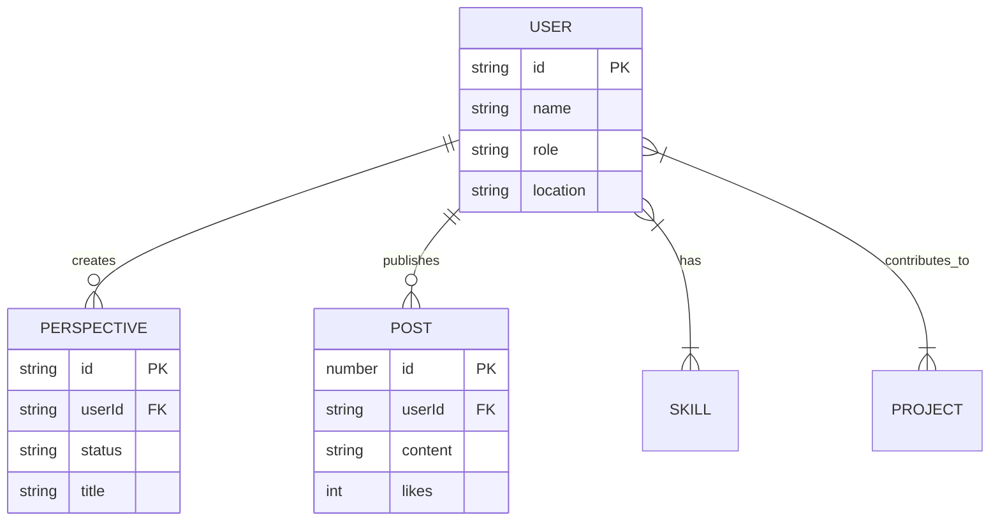

# Database Architecture Report

## Overview

This document outlines the data schemas and architectural relationships for the Loominn application. The system is designed to facilitate professional networking through "Perspectives" and AI-driven "Orbital Relevance".

## 1. Schema Definitions

The complete strict typing is defined in `src/lib/types/schema.ts`.

### Core Entities

#### User Profile (`UserProfile`)

The central identity of a professional.

```typescript
interface UserProfile {
  id: UUID;
  name: string;
  role: string;
  skills: string[];   // e.g. ["React", "AI"]
  projects: string[]; // e.g. ["Eco-Tracker"]
  // ... visuals (image, cover)
}
```

#### Perspective (`Perspective`)

A "Brief" or story shared by a user to showcase their work or thoughts.

```typescript
interface Perspective {
  id: UUID;
  userId: UUID;       // Foreign Key to UserProfile
  status: "Perspective" | "In Progress" | "Planning";
  items: PerspectiveItem[]; // Slides
}
```

## 2. Entity Relationship Diagram (ERD)



## 3. Top-Level Data Flow

1. **Persistence Layer**: `GlobalStateContext` acts as the client-side ORM. It hydrates data from `localStorage` on boot.
2. **AI Layer**: The `relevance.ts` engine sits on top of the User data. It pulls `UserProfile` (Active User) and matches it against the pool of `MOCK_USERS_DB` (Potential Partners) using the `skills` and `projects` arrays as vector-like inputs.
3. **Sync**: `StoriesRail` dynamically joins `Perspective` data with `UserProfile` data at runtime to ensure the current user's avatar is always fresh.

## 4. Improvements Implemented

- **Centralized Types**: Moved all interfaces to `src/lib/types/schema.ts`.
- **Mock Registry**: Moved hardcoded component data to `src/lib/data/mock.ts` to simulate a real database table.
- **Strict ID Typing**: Standardized on string-based IDs (UUIDs) for Users and Perspectives.
