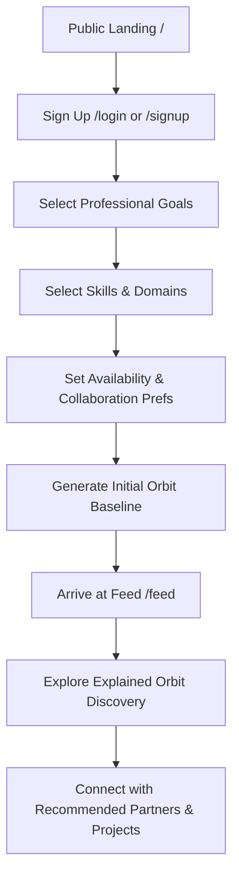
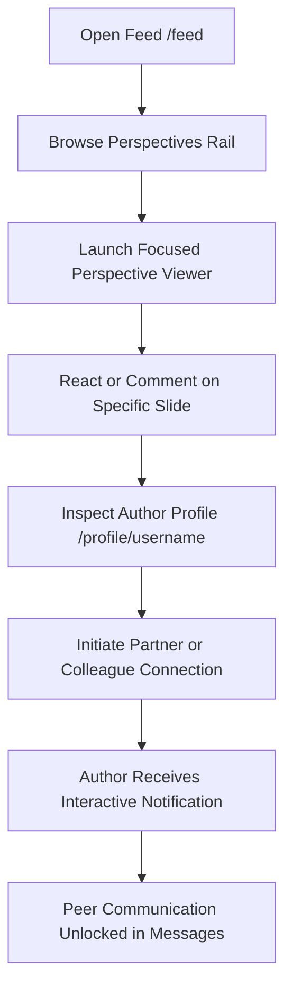
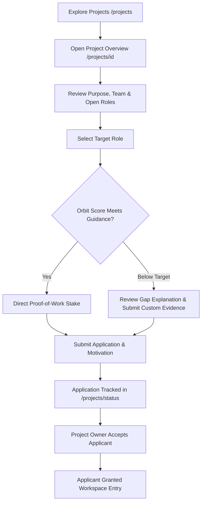
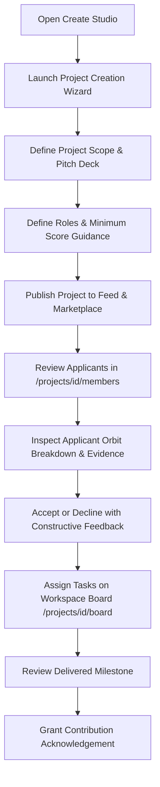

# Loominn Product Flow & Architecture Specification

## 1. Executive Product Definition

**Loominn** is a work-centered social network designed for creators, software architects, designers, engineers, and researchers.

Loominn is founded on a core insight: existing professional networks have degenerated into algorithmic feeds of vanity engagement, while collaboration platforms remain isolated workspaces with no discovery layer. Loominn bridges this gap by grounding social interaction in tangible craft, peer collaboration, and verified credibility.

### 1.1 What Loominn Is
1. **A Home for Perspectives**: Ephemeral and persistent records of ideas, technical breakthroughs, experiments, learning curves, and in-progress milestones.
2. **Orbit Discovery**: An explainable, multi-dimensional recommendation engine that connects people, projects, and Perspectives based on shared technical domains, complementary skills, and collaboration availability.
3. **Multi-Tier Professional Relationships**: Moving beyond binary "connections" to granular relationships: **Partners** (active co-creators), **Colleagues** (shared domain peers), and **Allies** (mentors, sponsors, and endorsers).
4. **Transparent Project Marketplaces**: Projects requiring specialized contributors with clearly stated role expectations, milestones, and Orbit Score guidance.
5. **Collaborative Workspaces**: Lightweight project environments unifying kanban task execution, milestone timelines, channel communication, and evidence submission.
6. **Proof of Work & Credibility**: An objective, cumulative Orbit Score and verified contribution history reflecting real delivery, complexity, and peer acknowledgement rather than vanity metrics.

### 1.2 What Loominn Is Not
1. **Not a Generic Social Media Clone**: No vanity follower counts, superficial clickbait, or ungrounded status updates.
2. **Not a Pure Project Management Tool**: Projects exist within a living community where outcomes feed directly back into public discovery.
3. **Not an Arbitrary Gatekeeper**: Orbit Score is never a mysterious "black box" algorithm. Every recommendation and role threshold is transparently explained with actionable paths to eligibility.

---

## 2. Information Architecture & Navigation

### 2.1 Navigation Model
Loominn employs a high-focus **Floating Dock** on desktop and a thumb-accessible **Bottom Navigation Bar** on mobile devices, preventing dashboard clutter and preserving maximum workspace real estate.

#### Primary Navigation (Dock & Mobile Nav):
1. **Home (`/`)**: High-level platform dashboard, featured project spotlights, active discussions, and system updates.
2. **Feed (`/feed`)**: Stream of Perspectives, Posts, Project Opportunities, Contributions, and Announcements, preceded by the StoriesRail.
3. **Projects (`/projects`)**: Collaborative project marketplace, role openings, and active workspaces.
4. **Create (`/projects/create` & `/create`)**: Unified studio for publishing Posts, Perspectives, Project Launches, or updating vResumes.
5. **Profile (`/profile`)**: Personal craft showcase, Orbit Score radar, active commitments, and contribution ledger.

#### Contextual Navigation:
1. **Discover (`/discover`)**: Unified multi-dimensional search across `For You`, `People`, `Projects`, `Perspectives`, and `Topics`.
2. **Network (`/network`)**: Relationship management across Partners, Colleagues, Allies, and incoming requests.
3. **Messages (`/messages`)**: Direct communication between accepted partners and project peers.
4. **Channels (`/channels`)**: Multi-channel community and project voice/chat rooms.
5. **My Projects (`/my-projects`)**: Filtered workspace directory for projects owned or joined.
6. **Project Status (`/projects/status`)**: Live tracking of submitted role applications and owner review queues.
7. **Bookmarks (`/bookmarks`)**: Saved Perspectives, reference projects, and inspiration.
8. **History (`/history`)**: Audit trail of contributions, completed phases, and reviewed work.
9. **Settings (`/settings`)**: Privacy, location tracking, credentials, and safety moderation.

---

## 3. Core Content Types & Card Architecture

Every item in the Loominn feed serves a distinct functional purpose and carries specialized interaction patterns:

| Content Type | Primary Purpose | Key Metadata Displayed | Actions Supported |
| :--- | :--- | :--- | :--- |
| **PostCard** | Technical thoughts, design ideas, brief updates | Author, timestamp, tags, text, media | React, Comment, Save, Share, Follow |
| **PerspectiveCard** | Deep work, prototypes, visual iterations, experiments | Status (Perspective/In Progress/Planning), items preview, author craft tag | Open Viewer, React, Comment, Save, Connect |
| **ProjectOpportunityCard** | Call for collaborators & defined project roles | Required roles, Orbit Score thresholds, timeline, difficulty, team preview | Inspect Roles, Stake & Apply, Bookmark, Share |
| **ContributionCard** | Verified proof of delivered project work | Target project, delivered tasks/milestones, peer acknowledgement badge | Verify Evidence, Inspect Project, Endorse, Congratulate |
| **AnnouncementCard** | Official platform updates & architecture changelogs | Release tag, system badge, roadmap links | Read Release, Bookmark, Discuss |

---

## 4. End-to-End User Flows

### Flow 1: First-Time User Onboarding

1. **Discovery & Sign Up**: User lands on public overview, registers via credentials or OAuth.
2. **Goal Onboarding**: User indicates primary intent (e.g., *Building a Product*, *Contributing as Specialist*, *Finding Co-founders*).
3. **Skill & Interest Taxonomy**: User selects 3-5 core competencies (e.g., Next.js, Rust, 3D Design) and domains (e.g., Fintech, AI, Creative Tools).
4. **Availability Setting**: Sets commitment capacity (e.g., *5-10 hrs/week*, *Full-time collaborator*).
5. **Dynamic Feed Inception**: The user lands directly on `/feed` with personalized suggestions grounded in their onboarding choices.

---

### Flow 2: Daily Social & Learning Loop

1. User reviews active **Perspectives** in the top rail.
2. Clicks a Perspective to launch the full-screen interactive viewer with progress indicators.
3. User leaves technical feedback or connects directly with the creator.
4. Notifications alert both parties, linking directly back into unified messaging.

---

### Flow 3: Project Role Discovery & Staking Application

1. Contributor navigates to `/projects` and filters by domain or role.
2. Contributor opens `/projects/[id]` and inspects role expectations.
3. If their Orbit Score meets or exceeds guidance, they stake their score as proof-of-commitment.
4. If below, the platform explicitly explains why (e.g., *"Requires 1,500 score; your score is 1,200 (+300 needed through 1 additional verified project)"*) and allows submitting direct portfolio evidence.
5. The application enters the owner's review queue.

---

### Flow 4: Project Owner Lifecycle & Team Management

1. Owner opens Project Wizard, specifying roadmap, pitch slides, and specific contributor seats.
2. Roles specify expected competencies and target Orbit tiers.
3. Incoming applications show the applicant's verified track record, velocity, and motivation.
4. On acceptance, the member is provisioned into the project's private workspace, boards, and channel rooms.

---

### Flow 5: Contribution, Verification & Credibility Accretion
1. **Task Execution**: Contributor picks up a card on `/projects/[id]/board`.
2. **Discussion**: Contributor syncs in `/channels` under the project room.
3. **Completion**: Contributor marks task *Done* and attaches link/evidence.
4. **Acknowledgement**: Project owner approves the delivery and issues an official acknowledgement.
5. **Ledger Update**: The contribution is permanently recorded in the user's `/history` and profile, updating their Orbit velocity and complexity metrics.

---

### Flow 6: Safety, Trust & Content Control
1. Any post, perspective, message, or user profile includes an actionable safety menu (`Mute`, `Block`, `Report`).
2. Selecting **Report** presents structured categories (*Spam*, *Harassment*, *Stolen Work*, *Fraudulent Evidence*).
3. The platform displays an immediate confirmation explaining moderation review steps.
4. Muted and blocked accounts are persistently managed under `/settings` with instant reversal controls.

---

## 5. Relationship States & Network Semantics

Loominn structures professional networks into three intentional relationship types:

```
[Suggested] ---> [Request Sent] ---> [Connected]
                         |                 |
                         v                 +---> Partner   (Active Co-Creator)
                    [Declined]             +---> Colleague (Domain Peer)
                                           +---> Ally      (Sponsor / Mentor)
```

1. **Partner**: High-trust collaborative relationship for co-founders and active team members.
2. **Colleague**: Domain peer for technical exchange, code review, and feedback.
3. **Ally**: Supporter, investor, mentor, or career advocate.
4. **Safety Overrides**: Any connection can be `Muted` (hidden from feed) or `Blocked` (complete mutual invisibility).

---

## 6. Orbit Discovery & Score Engine Formulas

### 6.1 Orbit Discovery Matching Logic
Suggestions never appear arbitrarily. Each recommended profile provides an explicit **Match Breakdown**:
- **Skills Overlap**: Shared programming languages, libraries, and design tools (+15 pts per match).
- **Domain Density**: Overlap between past projects and active research areas (+10 pts per match).
- **Collaboration Alignment**: Complementary roles (e.g., Designer looking for Frontend Lead) (+20 pts).
- **Verified Trust Bonus**: Scaled logarithmic bonus based on proven delivery record (0-15 pts).

### 6.2 Orbit Score Formula (V2 Proof of Work)
$$\text{Base Power} = \text{Velocity} + (\text{Projects Completed} \times 10) + (\text{On-Time Deliveries} \times 5)$$
$$\text{Orbit Score} = \left\lfloor \frac{\text{Base Power} \times \text{Complexity}}{\max(\text{Risk}, 1)} \right\rfloor$$

#### Tiering:
- **Novice**: $< 500$
- **Contributor**: $500 - 1,499$
- **Developer**: $1,500 - 2,999$
- **Senior**: $3,000 - 5,999$
- **Architect**: $6,000 - 9,999$
- **Grandmaster**: $\ge 10,000$
