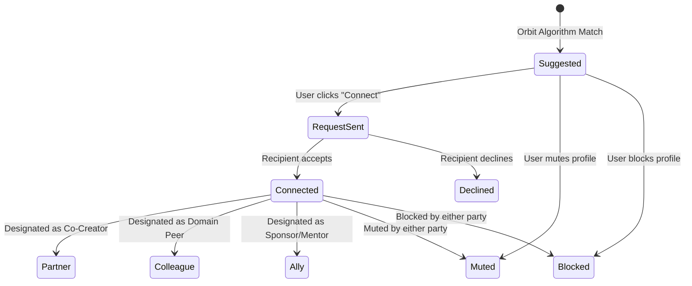

# Loominn Screen Inventory & State Matrix

This document provides a comprehensive inventory of all screens, routes, components, and state definitions across Loominn.

---

## 1. Screen & Route Catalog

### 1.1 Public & Account Surfaces

| Route | Screen Name | Current State | Intended State | Key Open Gaps |
| :--- | :--- | :--- | :--- | :--- |
| `/` | **Landing / Home Dashboard** | Hybrid landing and activity spotlight with static posts | Contextual landing: shows craft showcase if guest, personalized pulse if logged in | Unify guest preview with authenticated dashboard |
| `/login` | **Sign In Surface** | Dual pane: abstract art + credentials / OAuth buttons | Fluid credentials login with demo quick-entry and OAuth | Needs streamlined password reset link & validation feedback |
| `/signup` | **Account Creation** | Basic registration form in `(auth)/signup` | Full onboarding gateway initiating goal and skill questionnaire | Connect directly to onboarding flow |
| `/onboarding` | **User Onboarding Flow** | Missing (modal mockup in profile) | Multi-step interactive flow: Goals -> Skills & Domains -> Availability -> Baseline Orbit Score | Currently non-existent route |
| `/presentation` | **Interactive Pitch Deck** | Full-screen interactive slide presentation | High-fidelity product vision deck with live audio/video and supply-chain transparency | Maintain as standalone presentation deck |

---

### 1.2 Social & Discovery Surfaces

| Route | Screen Name | Current State | Intended State | Key Open Gaps |
| :--- | :--- | :--- | :--- | :--- |
| `/feed` | **Network Feed** | Mixed feed displaying all items through `ProjectCard` | Diverse feed rendering `PostCard`, `PerspectiveCard`, `ProjectOpportunityCard`, `ContributionCard`, `AnnouncementCard` | Separate cards, restore rich interactions (comments, reactions, saving) |
| `/feed` (overlay) | **Perspective Viewer** | StoriesRail slide modal with auto-timer | Full-screen immersive Perspective viewer with slide navigation, comment sheet, and author craft details | Add comment sheet, persistence, and share action |
| `/discover` | **Orbit Discovery** | Minimal search input with placeholder box | Multi-tab discovery hub: `For You`, `People`, `Projects`, `Perspectives`, `Topics` with match explanations | Implement full tabbed layout, filter chips, and live search |
| `/social` | **Discover People** | Static list of suggested users with mock partner button | Route alias or redirect to `/discover?tab=people` with full relationship state support | Merge into unified Discover experience |
| `/bookmarks` | **Saved Collection** | Basic list of saved project cards | Categorized library of saved Perspectives, Projects, Code snippets, and Research notes | Filter by type, empty state with "Browse Feed" prompt |
| `/notifications` | **Activity & Notification Center** | Slide-out tray in Dock | Interactive notification panel tracking applications, mentions, reactions, and project invitations | Add actionable buttons (Accept/Decline within notification) |

---

### 1.3 Network & Communication Surfaces

| Route | Screen Name | Current State | Intended State | Key Open Gaps |
| :--- | :--- | :--- | :--- | :--- |
| `/network` | **Relationship Center** | Two tabs (Partners, Requests) with mock data | Triple relationship tiers: **Partners** (active), **Colleagues** (peers), **Allies** (sponsors), plus pending requests | Connect to real state, support type conversion and filtering |
| `/profile` | **Own Profile** | Large profile page with cover editor, activity tab, and Orbit stats | Canonical creator profile with Orbit radar, active project commitments, vResume, and verified contribution history | Fix tab contents, add public view preview toggle |
| `/profile/[username]` | **Public Profile** | Static profile mockup with mock projects | Dynamic creator profile displaying Orbit Score, public perspectives, open projects, and connection actions | Wire dynamic data from `MOCK_USERS_DB` and local state |
| `/messages` | **Direct Messaging** | Minimal 11-line placeholder text | Split-pane messenger: conversation list on left, real-time message thread on right with rich attachment support | Replace placeholder with fully functioning messaging view |
| `/channels` | **Project & Community Channels** | Multi-channel layout with chat, meeting, and board tabs | Unified communication rooms organized by project and public interest topics | Connect channel chats to active projects and state |

---

### 1.4 Projects & Collaboration Surfaces

| Route | Screen Name | Current State | Intended State | Key Open Gaps |
| :--- | :--- | :--- | :--- | :--- |
| `/projects` | **Project Marketplace** | Grid of projects with filter chips and search | Opportunity marketplace with role badges, difficulty levels, score thresholds, and search | Filter by roles, domain, and eligibility |
| `/my-projects` | **My Projects Directory** | Clean card grid with status and stats | Personal project index separating owned projects from joined projects, with quick links to workspaces | Add "Joined" tab and workspace shortcuts |
| `/projects/create` & `/create` | **Project Studio & Creation Wizard** | Quick draft form + Multi-step ProjectWizard | Comprehensive studio for publishing Posts, Perspectives, or launching full Projects with role definitions | Support publishing directly into Feed and global state |
| `/projects/[id]` | **Project Overview** | Workspace layout with stats and "Commit with Orbit Score" | Comprehensive project landing page: Pitch, Roadmap, Open Roles, Team, and Workspace entry | Display role cards with score requirements and "Apply" buttons |
| `/projects/[id]/board` | **Workspace Kanban** | 4-column static board with empty columns | Interactive kanban board allowing task creation, dragging/moving across columns, and assigning to team members | Enable adding, moving, and completing tasks |
| `/projects/[id]/timeline` | **Workspace Gantt Timeline** | Static phase chart with progress bars | Interactive roadmap with milestones, deliverables, and completion status | Allow adding milestones and checking progress |
| `/projects/[id]/members` | **Workspace Members & Roles** | Single member row with demo role slider | Member directory with role badges, pending applicant review queue, and invitation triggers | Enable owner to accept/decline applicants |
| `/projects/status` | **Application Status Tracker** | Status tracking page | Real-time tracker for submitted applications (Submitted, Under Review, Accepted, Declined with Feedback) | Link directly into project workspace upon acceptance |

---

### 1.5 Credibility, History & Settings Surfaces

| Route | Screen Name | Current State | Intended State | Key Open Gaps |
| :--- | :--- | :--- | :--- | :--- |
| `/history` | **Contribution History** | Simple list of viewed items | Chronological proof-of-work ledger recording completed project milestones, code commits, and peer acknowledgements | Redesign as verified contribution timeline |
| `/settings` | **Account & Privacy Settings** | Basic name, bio, and location tracking toggle | Full settings hub: Profile edit, Location tracking, Account Origin, Active Sessions, Blocked/Muted Users, and Data control | Add safety moderation controls (manage blocks/mutes) |

---

## 2. Universal State Matrix

Every key view in Loominn must support the standard state matrix:

```
                  +--------------------------------+
                  |         Loading State          |
                  +---------------+----------------+
                                  |
            +---------------------+---------------------+
            |                     |                     |
            v                     v                     v
    +---------------+     +---------------+     +---------------+
    |  Empty State  |     |Populated State|     |  Error State  |
    +-------+-------+     +-------+-------+     +-------+-------+
            |                     |                     |
            v                     v                     v
    +---------------+     +---------------+     +---------------+
    |First-Time User|     | Mobile Layout |     |  Retry Action |
    +---------------+     +---------------+     +---------------+
```

### 2.1 State Specifications
1. **Loading State**: Subtle Skeleton pulsing (`bg-zinc-900/80 animate-pulse`), matching exact card geometry; never blocking full-screen spinners for content areas.
2. **Empty State**: Context-aware illustration or icon, concise title, explanation of why it is empty, and a prominent primary action (e.g. *"No saved perspectives yet — Explore the Feed"*).
3. **First-Time State**: Educational onboarding card guiding the user to make their first contribution or connection.
4. **Populated State**: Full rich rendering with accessible typography, crisp contrast, and interactive hover surfaces.
5. **Error State**: Non-destructive notification indicating what failed (network, authorization, validation) without breaking surrounding UI.
6. **Retry State**: Direct inline CTA (e.g. *"Failed to load perspectives. Try Again"*).
7. **Permission State**: Clear callout when an action requires authentication, partner connection, or project ownership.
8. **Success Confirmation**: Toast notification or micro-animation confirming state transition (e.g. *"Application submitted with 1,500 Orbit Score staked"*).
9. **Mobile Responsive State**: Seamless transition to vertical stack, full-width touch targets (minimum 44x44px), and bottom drawer sheets.

---

## 3. Project-Specific Lifecycle States

Projects traverse 10 distinct states, each altering the UI and permissible actions:

| State | Contributor View | Owner View | Badge / Indicator |
| :--- | :--- | :--- | :--- |
| **1. Open for Applications** | "Stake & Apply" CTA enabled | "Review Applications (N)" callout | `bg-green-500/10 text-green-400` "Active Recruitment" |
| **2. Below Suggested Score** | "Score Below Target — Submit Evidence" | "Accepting Custom Portfolios" | `bg-yellow-500/10 text-yellow-400` "High Complexity" |
| **3. Application Submitted** | "Application Pending — Staked N Pts" | "New Applicant Pending Review" | `bg-blue-500/10 text-blue-400` "Applied" |
| **4. Owner Reviewing** | "Under Active Review" | "Evaluating Proof of Work" | `bg-purple-500/10 text-purple-400` "In Review" |
| **5. Accepted** | "Enter Project Workspace" button | "Onboarding Member" | `bg-emerald-500/10 text-emerald-400` "Accepted" |
| **6. Declined with Feedback** | "Feedback: [Specific Reason / Guidance]" | "Application Archived" | `bg-zinc-800 text-zinc-400` "Closed" |
| **7. Role Filled** | "Role Filled — Follow for Updates" | "Manage Roster" | `bg-zinc-800 text-zinc-500` "Filled" |
| **8. In Progress** | "Workspace Active" | "Track Milestones" | `bg-blue-500/10 text-blue-400` "In Execution" |
| **9. Project Paused** | "Project On Hold" | "Resume Project" | `bg-amber-500/10 text-amber-400` "Paused" |
| **10. Completed & Archived**| "Completed — Contributions Verified" | "Issue Final Acknowledgements" | `bg-purple-500/10 text-purple-400` "Delivered" |

---

## 4. Relationship State Machine

Relationships between users follow an explicit state transition model:


